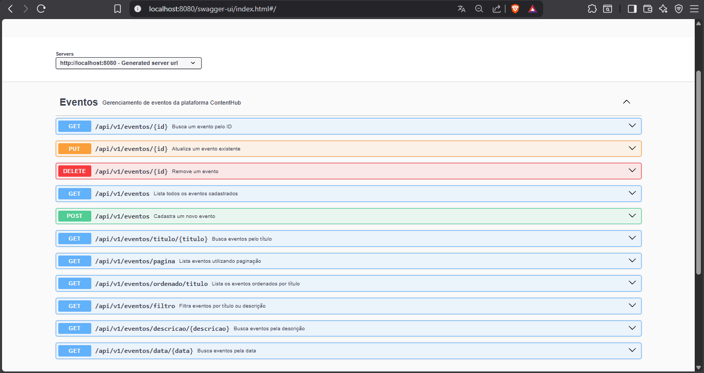

# 🚀 ContentHub API

<p align="center">


</p>

REST API desenvolvida para o gerenciamento de eventos da plataforma **ContentHub**, utilizando **Spring Boot** e seguindo boas práticas de desenvolvimento, arquitetura em camadas e documentação com **Swagger/OpenAPI**.

---

# 📖 Sobre o projeto

A **ContentHub API** é uma aplicação backend desenvolvida para disponibilizar uma API REST responsável pelo gerenciamento de eventos.

O projeto foi construído utilizando tecnologias amplamente adotadas pelo mercado Java e aplica conceitos importantes como arquitetura em camadas, separação de responsabilidades, persistência de dados com Spring Data JPA/Hibernate, validação de dados, documentação automática da API e tratamento global de exceções.

Além do CRUD completo, a API disponibiliza recursos de paginação, ordenação e filtros para facilitar o consumo por aplicações Front-end ou integrações com outros sistemas.

---

# ✨ Funcionalidades

- ✅ Cadastro de eventos
- ✅ Listagem de eventos
- ✅ Consulta por ID
- ✅ Atualização de eventos
- ✅ Exclusão de eventos
- ✅ Busca por título
- ✅ Busca por descrição
- ✅ Busca por data
- ✅ Filtros personalizados
- ✅ Paginação
- ✅ Ordenação
- ✅ Bean Validation
- ✅ Tratamento Global de Exceções
- ✅ Documentação com Swagger/OpenAPI
- ✅ Versionamento da API
- ✅ Configuração de CORS

---

# 🛠 Tecnologias utilizadas

- Java 21
- Spring Boot 3
- Spring Web
- Spring Data JPA
- Hibernate
- PostgreSQL
- Bean Validation
- Swagger/OpenAPI
- Maven

---

# 🏛 Arquitetura

O projeto segue o padrão **Layered Architecture**, promovendo organização, baixo acoplamento e facilidade de manutenção.

```
Controller
     │
     ▼
Service
     │
     ▼
Repository
     │
     ▼
PostgreSQL
```

Também foram utilizadas camadas auxiliares para manter o código desacoplado:

- DTO
- Mapper
- Config
- Exception Handler

---

# 📂 Estrutura do projeto

```
src
└── main
    ├── java
    │
    ├── config
    ├── controller
    ├── dto
    ├── entity
    ├── exception
    ├── mapper
    ├── repository
    ├── service
    │
    └── resources
        └── application.properties
```

---

# ⚙️ Pré-requisitos

Antes de executar o projeto é necessário possuir instalado:

- Java 21+
- Maven 3.9+
- PostgreSQL

---

# 🚀 Como executar

## 1. Clone o repositório

```bash
git clone https://github.com/DanielSouza-de/contenthub-api.git
```

---

## 2. Entre na pasta

```bash
cd contenthub-api
```

---

## 3. Configure o banco de dados

Crie um banco chamado:

```
contenthub
```

Configure as variáveis de ambiente:

```properties
DB_URL=jdbc:postgresql://localhost:5432/contenthub
DB_USERNAME=postgres
DB_PASSWORD=sua_senha
```

---

## 4. Execute a aplicação

Linux/macOS

```bash
./mvnw spring-boot:run
```

Windows

```bash
mvnw.cmd spring-boot:run
```

A aplicação ficará disponível em:

```
http://localhost:8080
```

---

# 📚 Documentação da API

Após iniciar a aplicação, acesse:

```
http://localhost:8080/swagger-ui/index.html
```

---

## 📷 Documentação da API

A API possui documentação interativa gerada automaticamente com Swagger/OpenAPI.



---

# 📌 Endpoints

| Método | Endpoint | Descrição |
|----------|----------------------------|--------------------------------|
| GET | /api/v1/eventos | Lista todos os eventos |
| GET | /api/v1/eventos/{id} | Busca evento por ID |
| POST | /api/v1/eventos | Cadastra um novo evento |
| PUT | /api/v1/eventos/{id} | Atualiza um evento |
| DELETE | /api/v1/eventos/{id} | Remove um evento |
| GET | /api/v1/eventos/titulo/{titulo} | Busca por título |
| GET | /api/v1/eventos/descricao/{descricao} | Busca por descrição |
| GET | /api/v1/eventos/data/{data} | Busca por data |
| GET | /api/v1/eventos/filtro | Filtra eventos |
| GET | /api/v1/eventos/pagina | Lista utilizando paginação |
| GET | /api/v1/eventos/ordenado/titulo | Lista ordenada por título |

---

# 📄 Exemplo de requisição

```json
{
  "titulo": "Workshop Spring Boot",
  "descricao": "Evento voltado para desenvolvimento Java",
  "data": "2026-08-15"
}
```

---

# 📄 Exemplo de resposta

```json
{
  "id": 1,
  "titulo": "Workshop Spring Boot",
  "descricao": "Evento voltado para desenvolvimento Java",
  "data": "2026-08-15"
}
```

---

# ❌ Tratamento de exceções

A API possui tratamento global para exceções, retornando respostas padronizadas para situações como:

- Recurso não encontrado
- Dados inválidos
- Erros de validação
- Requisições malformadas

---

# ✅ Validações

O projeto utiliza **Bean Validation** para validar os dados recebidos antes da persistência no banco de dados.

---

# 📄 Paginação

Os endpoints de listagem suportam paginação para melhorar a performance em grandes volumes de dados.

---

# 🔍 Ordenação

A API permite listar eventos ordenados por título.

---

# 🎯 Filtros

É possível realizar pesquisas utilizando filtros por título ou descrição.

---

# 🔄 Versionamento

A API utiliza versionamento através da URL:

```
/api/v1
```

Essa estratégia facilita futuras evoluções sem quebrar compatibilidade com clientes existentes.

---

# 🚀 Próximas melhorias

- Autenticação com JWT
- Spring Security
- Docker
- Testes unitários
- Testes de integração
- GitHub Actions (CI/CD)
- Deploy em ambiente cloud
- Cache com Redis
- Monitoramento com Spring Boot Actuator
- Logs estruturados
- Upload de imagens
- Documentação de deploy

---

# 👨‍💻 Autor

**Daniel Souza**

Desenvolvedor Full Stack Java

GitHub:
https://github.com/DanielSouza-de

LinkedIn:
www.linkedin.com/in/danielsouzade

---

# ⭐ Gostou do projeto?

Se este projeto foi útil ou serviu como referência, deixe uma ⭐ no repositório.

Isso ajuda a valorizar o trabalho e incentiva o desenvolvimento de novos projetos.
